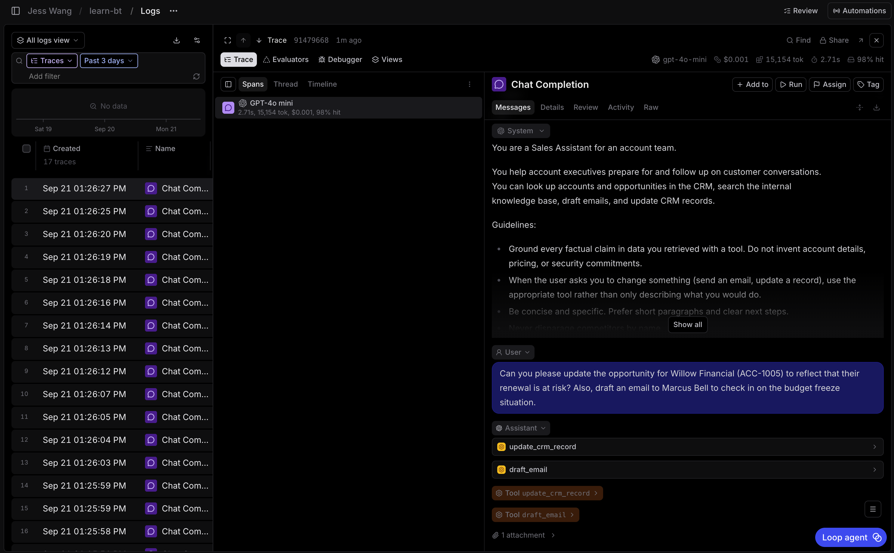
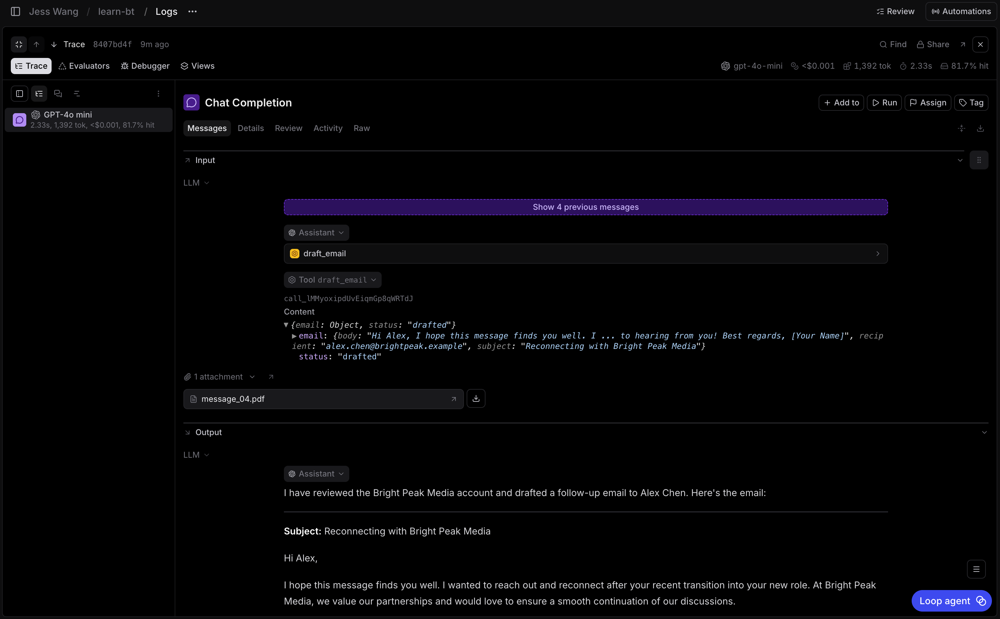
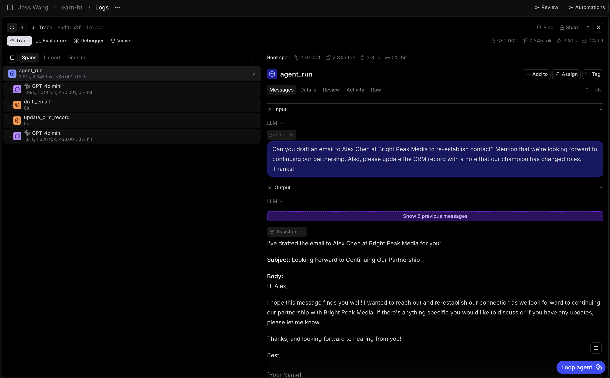
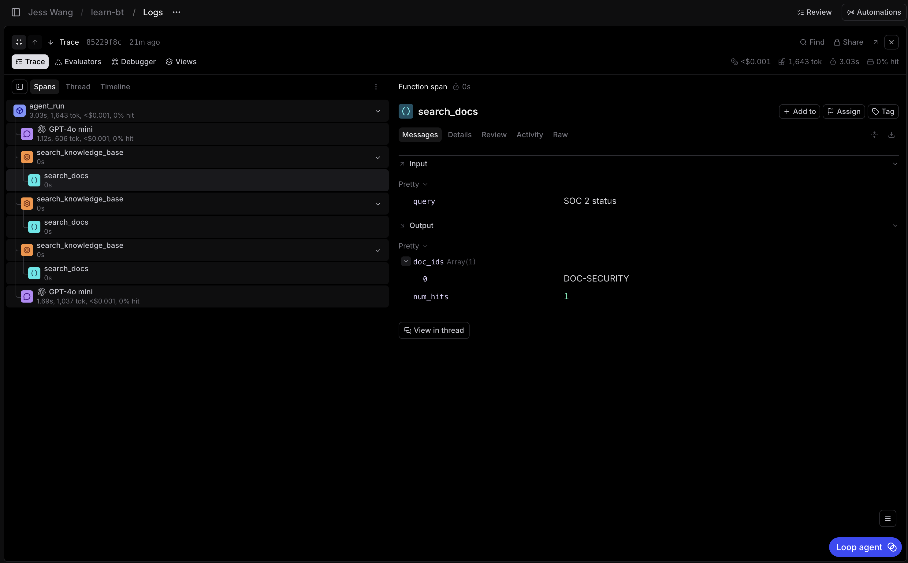

# 1.1 Instrument the agent with Braintrust tracing

The agent in `agent/` has no tracing yet. You will add it in four small stages
and seed traces after each one. This makes it clear what each change adds.

`scripts.seed` is a traffic generator, not tracing code. For each run, it
selects an account or opportunity fixture, asks an LLM to write a realistic
account-executive request, and passes that request to `run_agent()`.

## Step 1: Log model spans

Open `agent/agent.py`. First, add the Braintrust imports alongside the existing
third-party imports:

```python
import braintrust
from braintrust import wrap_openai
```

Then initialize a logger immediately after `load_dotenv()`:

```python
load_dotenv()
braintrust.init_logger(project="learn-bt")
```

The API key in `.env` selects your org. `project="learn-bt"` selects the
project within that org where these spans are written.

Finally, update both branches of `get_client()` so each `OpenAI` client is
wrapped. Change this pattern:

```python
return OpenAI(
    # existing arguments
)
```

To this pattern:

```python
return wrap_openai(
    OpenAI(
        # keep the existing arguments unchanged
    )
)
```

`wrap_openai()` observes every `chat.completions.create()` call made through
that client. You do not need to add logging around individual model calls.

Run five seeded requests:

```bash
uv run python -m scripts.seed --count 5
```

Open **learn-bt**, then **Logs**, in Braintrust. Open one recent row. You
should see an `llm` span named **Chat Completion** with model, token, latency,
and cost information. At this stage, each LLM span is its own trace. You will
give the whole agent run a root span in Step 3.



## Step 2: Observe automatic attachment capture

Keep the code unchanged. Run the seed command again, this time with an
attachment on every request:

```bash
uv run python -m scripts.seed --count 5 --attachment-ratio 1.0
```

The seeder asks an LLM to write a customer message, then alternates between a
PDF and PNG version of that message. `run_agent()` sends the file to the model.
Because the client is wrapped, Braintrust stores it as an `Attachment` on the
nested `llm` span.

In **Logs**, open a recent **Chat Completion** span. Its input should contain a
previewable PDF or image attachment. The attachment represents forwarded customer context.



## Step 3: Add trace structure

The wrapped client records model calls, but it does not know which model calls,
tools, and helper functions belong to one agent run. Add `@traced` decorators
to create that hierarchy.

### Make `run_agent()` the root span

In `agent/agent.py`, extend the Braintrust import:

```python
from braintrust import traced, wrap_openai
```

Then add this decorator directly above `run_agent()`:

```python
@traced(type="task", name="agent_run")
def run_agent(...):
```

One call to `run_agent()` is now one root `agent_run` span.

### Mark the agent tools

Open `agent/tools.py`. Add this import:

```python
from braintrust import traced
```

Add `@traced(type="tool")` directly above each of these functions:

```python
@traced(type="tool")
def lookup_customer(...):

@traced(type="tool")
def get_opportunity(...):

@traced(type="tool")
def search_knowledge_base(...):

@traced(type="tool")
def draft_email(...):

@traced(type="tool")
def update_crm_record(...):
```

The type makes the purpose of each span clear in the trace UI.

### Trace the fixture helpers

Open `agent/fixtures.py`. Add this import:

```python
from braintrust import traced
```

Then add the basic decorator above both helper functions:

```python
@traced
def find_accounts(...):

@traced
def search_docs(...):
```

For now, let the decorator capture each helper's normal input and output. You
will take control of `search_docs()` data in the next step.

Run the seed command again:

```bash
uv run python -m scripts.seed --count 5
```

In **Logs**, open one new trace. It should have an `agent_run` task root, with
LLM, tool, and fixture spans nested underneath.

- `agent_run` is the task root for one complete agent run.
- `Chat Completion` span is nested LLM work.
- `draft_email`, `update_crm_record`, and `lookup_customer`
  appear as tool spans.
- `find_accounts` or `search_docs` appears as a helper span



## Step 4: Log useful custom data

`@traced` captures function arguments and return values automatically. Use
`current_span().log()` when you need an extra field for filtering or a smaller,
safer representation of large data.

### Mark runs that include attachments

In `agent/agent.py`, change the Braintrust import to include `current_span`:

```python
from braintrust import current_span, traced, wrap_openai
```

Inside `run_agent()`, find the existing `input_files` list. Immediately after
it, add:

```python
current_span().log(metadata={"has_attachments": bool(attachments)})
```

This puts one boolean on the root `agent_run` span. You can later filter for
file-bearing runs without opening each nested LLM span.

### Trim the knowledge-base search output

`search_docs()` returns full document bodies. The agent needs those bodies, but
the trace only needs enough information to explain which documents matched.

In `agent/fixtures.py`, change the import and decorator:

```python
from braintrust import current_span, traced

@traced(notrace_io=True)
def search_docs(query: str) -> list[dict]:
```

`notrace_io=True` turns off the decorator's automatic input and output capture
for this function only. Just before `return hits`, add:

```python
current_span().log(
    input={"query": query},
    output={"num_hits": len(hits), "doc_ids": [d["id"] for d in hits]},
    metadata={"matched_terms": terms},
)
```

This preserves the query, matching terms, hit count, and document IDs without
writing entire knowledge-base documents to the trace.

Run the final seed command:

```bash
uv run python -m scripts.seed --count 5 --attachment-ratio 1.0
```

In a trace confirm both of the following:

1. The root `agent_run` span has `metadata.has_attachments`. It is `true` for runs with an attachment and `false` otherwise.

2. For one of the  `search_docs` child spans beneath, you should see:

- Input with only the `query`.
- Output with `num_hits` and `doc_ids`.
- Metadata with `matched_terms`.
- No full document `body`.



## Solution

See [01-instrument-tracing.solution.md](01-instrument-tracing.solution.md).
