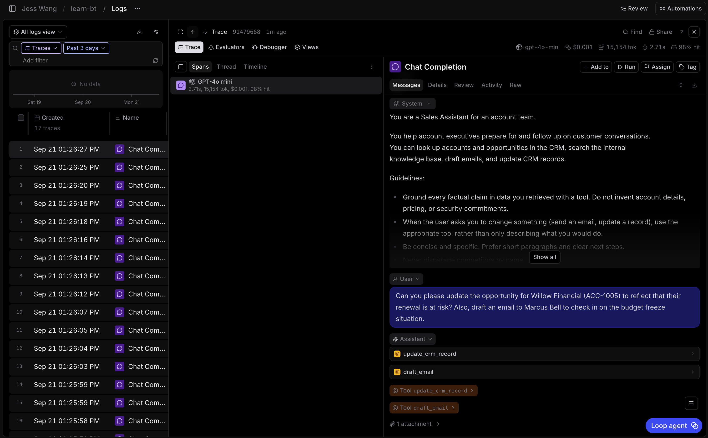
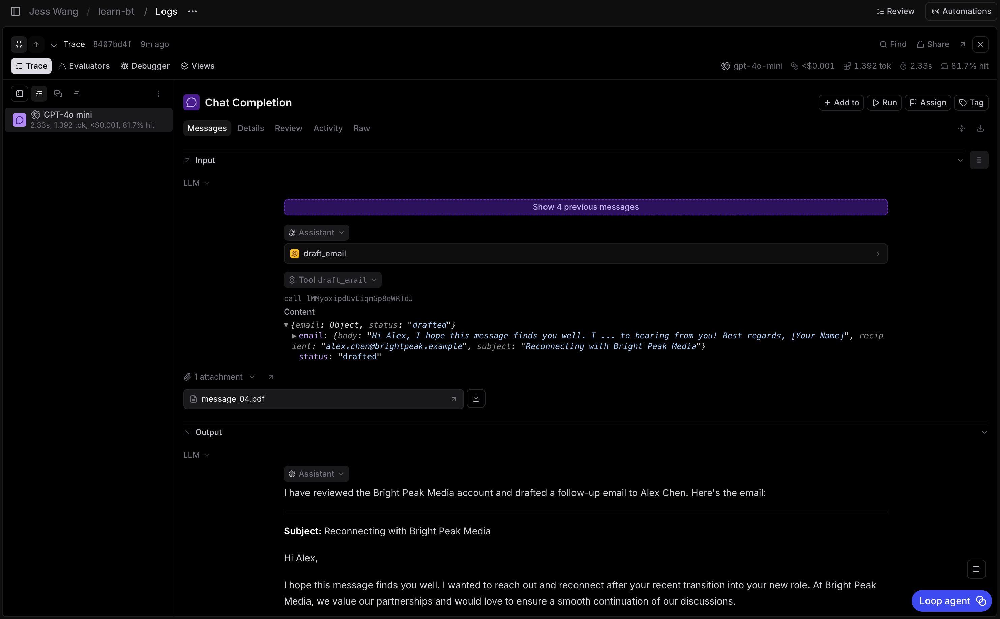
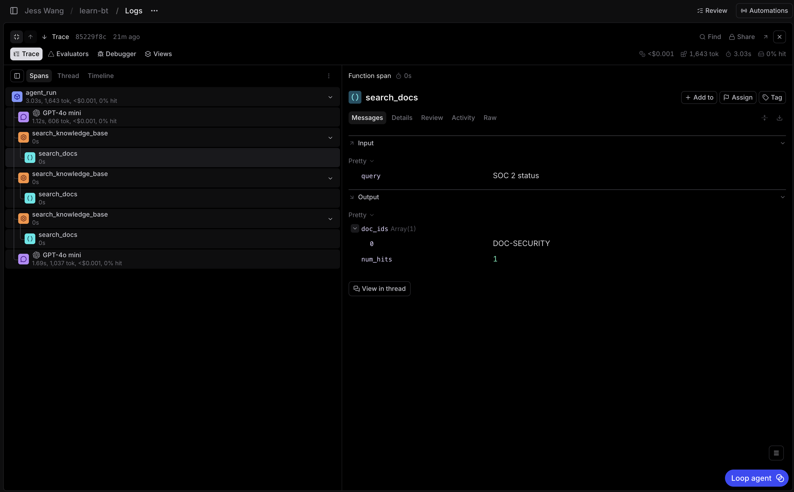

# 1.1 Instrument the agent with Braintrust tracing

The agent in `agent/` has no tracing yet. You will add it in four small stages
and seed traces after each one. This makes it clear what each change adds.

`scripts.seed` is a traffic generator, not tracing code. For each run, it
selects an account or opportunity fixture, asks an LLM to write a realistic
account-executive request, and passes that request to `Agent.chat_turn()`.

## Step 1: Log model spans

Open `agent/agent.py`. First, add the Braintrust imports alongside the existing
third-party imports:

```python
import braintrust
from braintrust import wrap_openai
```

Then initialize a logger immediately after `load_dotenv()`:

```python
load_dotenv()
braintrust.init_logger(project="learn-bt")
```

The API key in `.env` selects your org. `project="learn-bt"` selects the
project within that org where these spans are written.

Finally, update both branches of `get_client()` so each `OpenAI` client is
wrapped. Change this pattern:

```python
return OpenAI(
    # existing arguments
)
```

To this pattern:

```python
return wrap_openai(
    OpenAI(
        # keep the existing arguments unchanged
    )
)
```

`wrap_openai()` observes every `chat.completions.create()` call made through
that client. You do not need to add logging around individual model calls.

Run five seeded requests:

```bash
uv run python -m scripts.seed --count 5
```

Open **learn-bt**, then **Logs**, in Braintrust. Open one recent row. You
should see an `llm` span named **Chat Completion** with model, token, latency,
and cost information. At this stage, each LLM span is its own trace. You will
give the whole agent run a root span in Step 3.



## Step 2: Observe automatic attachment capture

Keep the code unchanged. Run the seed command again, this time with an
attachment on every request:

```bash
uv run python -m scripts.seed --count 5 --attachment-ratio 1.0
```

The seeder asks an LLM to write a customer message, then alternates between a
PDF and PNG version of that message. `chat_turn()` sends the file to the model.
Because the client is wrapped, Braintrust stores it as an `Attachment` on the
nested `llm` span.

In **Logs**, open a recent **Chat Completion** span. Its input should contain a
previewable PDF or image attachment. The attachment represents forwarded customer context.



## Step 3: Add trace structure

The wrapped client records model calls, but it does not know which model calls,
tools, and helper functions belong to one customer turn. Add spans to create
that hierarchy.

### Make `chat_turn()` the root span

`Agent.chat_turn()` answers one customer message. In `agent/agent.py`, extend
the Braintrust import:

```python
from braintrust import start_span, wrap_openai
```

Then wrap the body of `chat_turn()`, everything after its docstring, in a span.
Indent the existing code one level under the `with` block:

```python
with start_span(name="chat_turn", type="task") as span:
    client = get_client()
    # ... the rest of the existing body, indented ...
```

One call to `chat_turn()` is now one `chat_turn` trace. The agent holds no
conversation state, so a multi-turn conversation is a series of `chat_turn`
traces. Each later turn receives the earlier messages as its `history` input.

### Log the turn's request and reply

`start_span()` records the span's timing and nesting, but it does not capture
any data on its own. Log the request and the reply yourself. Immediately after
the `input_files` list, add:

```python
span.log(input={"prompt": prompt, "history": history})
```

The input is the request plus the messages from earlier turns, which is
everything needed to replay the turn. Then find the branch that returns the final
reply and log only the reply text before returning the result:

```python
if not message.tool_calls:
    result = AgentResult(output=message.content or "", new_messages=new_messages)
    span.log(output={"output": result.output})
    return result
```

The output holds the reply and not `new_messages`, which would repeat every
nested model and tool span.

### Mark the agent tools

Open `agent/tools.py`. Add this import:

```python
from braintrust import traced
```

Add `@traced(type="tool")` directly above each of these functions:

```python
@traced(type="tool")
def lookup_customer(...):

@traced(type="tool")
def get_opportunity(...):

@traced(type="tool")
def search_knowledge_base(...):

@traced(type="tool")
def draft_email(...):

@traced(type="tool")
def update_crm_record(...):
```

The type makes the purpose of each span clear in the trace UI.

### Trace the fixture helpers

Open `agent/fixtures.py`. Add this import:

```python
from braintrust import traced
```

Then add the basic decorator above both helper functions:

```python
@traced
def find_accounts(...):

@traced
def search_docs(...):
```

For now, let the decorator capture each helper's normal input and output. You
will take control of `search_docs()` data in the next step.

Run three two-turn conversations. `--conversation-turns` is the number of
customer messages in one conversation, which is separate from
`config.max_tool_calls`, the number of tool calls the agent may make to answer
one message:

```bash
uv run python -m scripts.seed --count 3 --conversation-turns 2
```

This creates six `chat_turn` traces, two for each conversation. In **Logs**,
open one of them. It should have a `chat_turn` task root, with LLM, tool, and
fixture spans nested underneath.

```text
chat_turn
├── Chat Completion
├── tool and helper spans
└── Chat Completion
```

- `chat_turn` is the task root for one customer turn.
- `Chat Completion` span is nested LLM work.
- `draft_email`, `update_crm_record`, and `lookup_customer`
  appear as tool spans.
- `find_accounts` or `search_docs` appears as a helper span

## Step 4: Log useful custom data

`@traced` captures function arguments and return values automatically. Use
`current_span().log()` when you need an extra field for filtering or a smaller,
safer representation of large data.

### Mark runs that include attachments

In `agent/agent.py`, find the `span.log(input=...)` call you added in Step 3.
Add a `metadata` argument to it:

```python
span.log(
    input={"prompt": prompt, "history": history},
    metadata={"has_attachments": bool(attachments)},
)
```

This puts one boolean on the root `chat_turn` span. You can later filter for
file-bearing runs without opening each nested LLM span.

### Group turns into a conversation

Each `chat_turn` is its own trace, so nothing yet ties the turns of one
conversation together. The caller already owns the conversation, so it also
owns a session ID. `chat_turn()` requires a `session_id`, and the seed
script generates one per conversation. The turn number is the number of user
messages already in `history`, plus one. Record both in the same metadata:

```python
turn_number = sum(m["role"] == "user" for m in history or []) + 1
span.log(
    input={"prompt": prompt, "history": history},
    metadata={
        "has_attachments": bool(attachments),
        "session_id": session_id,
        "turn_number": turn_number,
    },
)
```

This session id will allow us to group all turns of a conversation to reconstruct a full conversation, and the turn number puts them in order.

### Trim the knowledge-base search output

`search_docs()` returns full document bodies. The agent needs those bodies, but
the trace only needs enough information to explain which documents matched.

In `agent/fixtures.py`, change the import and decorator:

```python
from braintrust import current_span, traced

@traced(notrace_io=True)
def search_docs(query: str) -> list[dict]:
```

`notrace_io=True` turns off the decorator's automatic input and output capture
for this function only. Just before `return hits`, add:

```python
current_span().log(
    input={"query": query},
    output={"num_hits": len(hits), "doc_ids": [d["id"] for d in hits]},
    metadata={"matched_terms": terms},
)
```

This preserves the query, matching terms, hit count, and document IDs without
writing entire knowledge-base documents to the trace.

Run the final seed command:

```bash
uv run python -m scripts.seed --count 5 --conversation-turns 2 --attachment-ratio 1.0
```

In a trace confirm each of the following:

1. The root `chat_turn` span has `metadata.has_attachments`. It is `true` for turns with an attachment and `false` otherwise. It also has `metadata.session_id`, which is the same for both turns of a conversation, and `metadata.turn_number`, which is 1 for the first turn and 2 for the second.

2. The `chat_turn` input has `prompt` and `history`. The output has only
   `output`, with no `new_messages`. For the first turn of a conversation
   `history` is empty. For the second turn it holds the first turn's messages.

3. For one of the  `search_docs` child spans beneath, you should see:

- Input with only the `query`.
- Output with `num_hits` and `doc_ids`.
- Metadata with `matched_terms`.
- No full document `body`.



## Answer key

Compare your completed source files with:

- [`agent/agent.py`](solutions/01-instrument-tracing/agent/agent.py)
- [`agent/tools.py`](solutions/01-instrument-tracing/agent/tools.py)
- [`agent/fixtures.py`](solutions/01-instrument-tracing/agent/fixtures.py)
