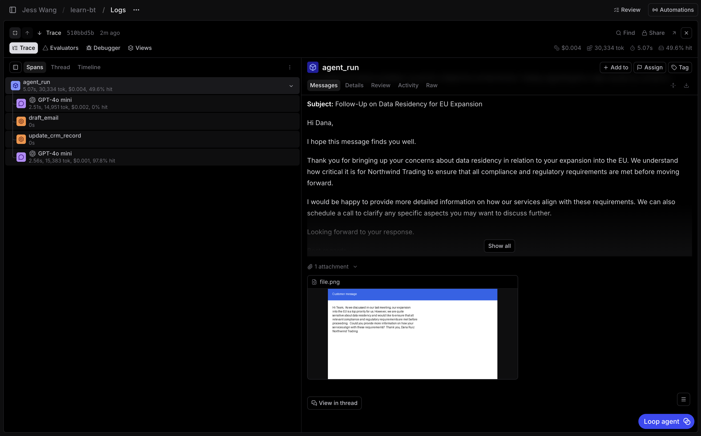

# 1.2 Log attachments on the root span

Exercise 1.1 showed that `wrap_openai()` automatically captures attachments on
the nested LLM span. In this exercise, you will also log the attachment on the
root `agent_run` span. That makes the file visible when you filter logs, review
a run, or add the run to a dataset.

## Step 1: Import `Attachment`

In `agent/agent.py`, change the Braintrust import to include `Attachment`:

```python
from braintrust import Attachment, current_span, traced, wrap_openai
```

`Attachment` stores file bytes in Braintrust's attachment store and records a
reference in the span input.

## Step 2: Replace the root-span log call

`run_agent()` already converts every file path or dataset attachment into an
`InputFile` in `input_files`. Replace the metadata-only log call with this:

```python
current_span().log(
    input={
        "attachments": [
            Attachment(data=f.data, filename=f.filename, content_type=f.media_type)
            for f in input_files
        ]
    },
    metadata={"has_attachments": bool(attachments)},
)
```

Use `input_files`, not the raw `attachments` argument. That single list already
handles a local path and an attachment hydrated from a dataset row.

Keep `has_attachments`. The boolean gives you a fast filter. The attachment in
the root input gives a reviewer the actual file to open.

## Step 3: Run and inspect it

Seed requests that all include a file:

```bash
uv run python -m scripts.seed --count 5 --attachment-ratio 1.0
```

Open **learn-bt**, then **Logs**, and select a new `agent_run` trace. On the
root span, `input.attachments` should show a previewable PDF or image.



## Answer key

Compare your completed [`agent/agent.py`](02-log-attachments.solution/agent/agent.py)
with this answer key.
