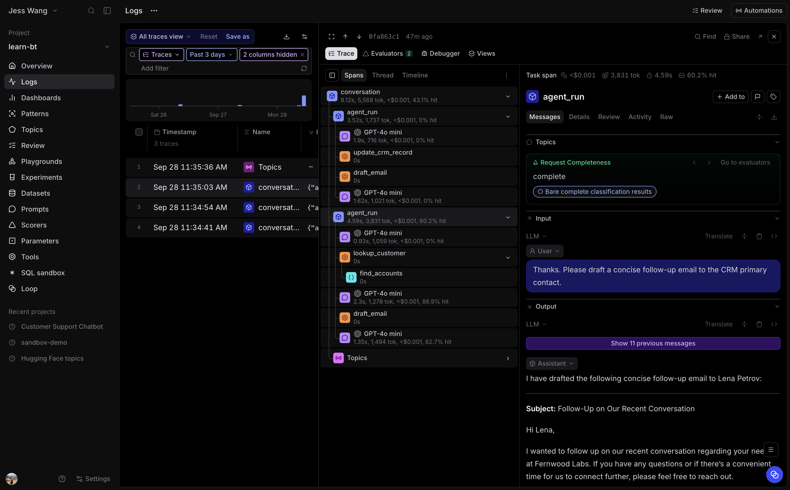

# 1.3 Keep a conversation in one trace

A customer conversation can include several customer messages. This exercise
keeps the interaction together as one root `conversation` span, with one nested
`agent_run` span for each customer turn.

## Step 1: Add a conversation root around the existing agent run

Open `agent/agent.py`. `run_agent()` continues to own one customer turn. Leave
its existing `@traced(type="task", name="agent_run")` decorator in place.

First, add a `history` parameter between `attachments` and `config` in
`run_agent()`:

```python
def run_agent(
    prompt: str,
    attachments: Sequence[str | Path | InputFile] | None = None,
    history: Sequence[dict[str, Any]] | None = None,
    config: AgentConfig = DEFAULT_CONFIG,
) -> AgentResult:
```

Find the `messages` list that starts with `config.system_prompt_messages`.
Replace it with:

```python
messages: list[dict[str, Any]] = [
    *(history if history is not None else config.system_prompt_messages),
    _user_message(prompt, input_files),
]
```

The first customer turn starts with the system prompt. Every later turn receives
the prior `AgentResult.messages` as history, then appends its new customer
request.

There are two kinds of turns in this application:

- `--conversation-turns` is the number of customer messages in one conversation.
- `config.max_turns` is the number of LLM and tool cycles the agent may use to answer one customer message.

Next, add this function immediately after `run_agent()`. It owns the root
conversation span and passes the history from one customer turn to the next.
It reuses the existing `run_agent()` function, so that function becomes a child
span for each turn.

```python
@traced(type="task", name="conversation")
def run_conversation(
    prompts: Sequence[str],
    attachments_by_turn: Sequence[Sequence[str | Path | InputFile] | None] | None = None,
    config: AgentConfig = DEFAULT_CONFIG,
) -> list[AgentResult]:
    if not prompts:
        raise ValueError("A conversation needs at least one customer turn.")
    if attachments_by_turn is None:
        attachments_by_turn = [None] * len(prompts)
    if len(attachments_by_turn) != len(prompts):
        raise ValueError("Provide one attachment list for each customer turn.")

    history: list[dict[str, Any]] | None = None
    results: list[AgentResult] = []
    for prompt, attachments in zip(prompts, attachments_by_turn, strict=True):
        result = run_agent(
            prompt,
            attachments=attachments,
            history=history,
            config=config,
        )
        results.append(result)
        history = result.messages
    return results
```

Keep the instrumentation already added in the earlier exercises. It continues
to record the model, tools, attachments, and custom spans inside each turn.

## Step 2: Use the existing seed script

Use the built-in multi-turn option in `scripts.seed`. It calls
`run_conversation()` after you complete Step 1. You do not need to change the
seed script for this exercise.

Run three two-turn conversations:

```bash
uv run python -m scripts.seed --count 3 --conversation-turns 2
```

This creates three root `conversation` traces. Each trace contains two nested
`agent_run` spans. The first is a generated account-executive request. The
second is a follow-up request that uses the first turn's messages as history.

## Step 3: Inspect the conversation trace

Open **learn-bt**, then select **Logs**. Open one of the new `conversation`
traces. The root span organizes the interaction, so its own input and output
may be empty. Select an `agent_run` child to inspect the request, response, and
agent work for one customer turn.

The span tree should look like this:

```text
conversation
├── agent_run                         customer turn one
│   ├── Chat Completion
│   └── tool and helper spans
└── agent_run                         customer turn two
    ├── Chat Completion
    └── tool and helper spans
```

The `conversation` root gives you one place to inspect the complete customer
interaction. Each nested `agent_run` isolates one customer turn.



## Answer key

Compare your completed source files with:

- [`agent/agent.py`](solutions/03-trace-multi-turn-conversations/agent/agent.py)
- [`scripts/seed.py`](solutions/03-trace-multi-turn-conversations/scripts/seed.py)
