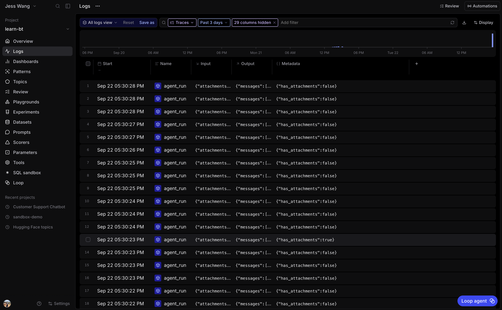
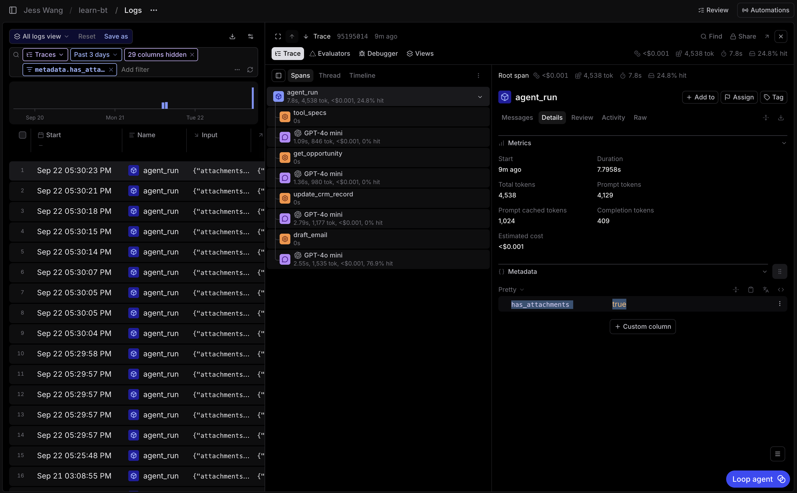
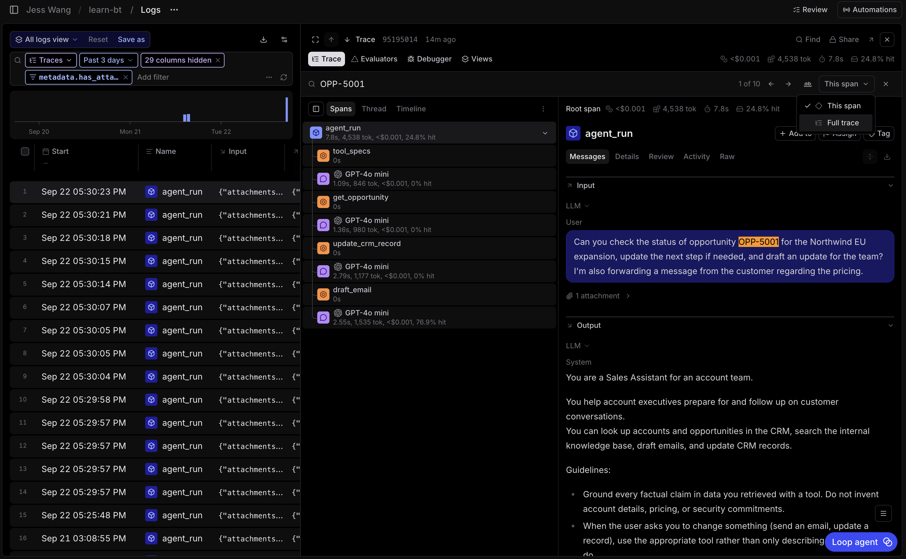
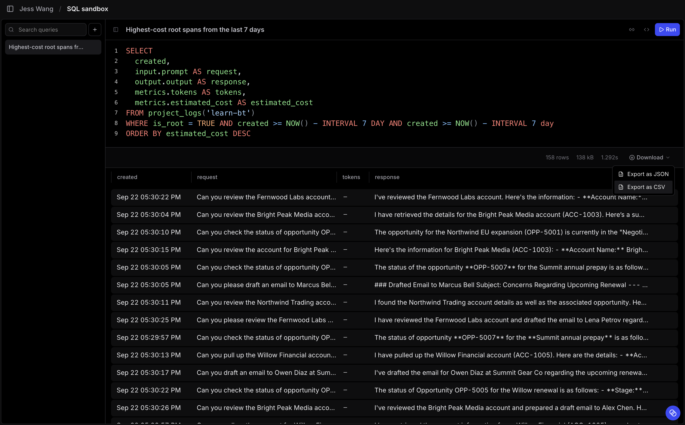

# 2.1 Query logs with filters, SQL, and the CLI [UI + CLI]

This exercise uses the traces you instrumented in Section 1. You will answer the same question with a Logs filter, SQL, and the CLI.

## Step 1: Create enough traffic

From the repository root, use either option.

**Option 1: Generate new traffic**

~~~bash
uv run python -m scripts.seed --count 150 --conversation-turns 2 --attachment-ratio 0.2 --concurrency 10
~~~

This creates up to 150 synthetic, two-turn customer conversations in your
`learn-bt` project. Each conversation is one `conversation` root trace with
two nested `agent_run` spans, one for each customer turn. About 20% of the
conversations include an attachment, and up to 10 conversations run at once.

This option makes model calls. `scripts.seed` uses `gpt-4o-mini` to generate
each synthetic account-executive request. The Sales Assistant also uses
`gpt-4o-mini` to handle each turn. A turn that uses tools can make more than
one Sales Assistant model call.

**Option 2: Replay the included snapshot**

~~~bash
uv run --env-file .env python -m scripts.seed_default --project learn-bt
~~~

This option does not call a model provider. It replays 150 recorded two-turn
conversations from `scripts/seed_default/snapshot/`, uploads their attachments
to your Braintrust org, gives the spans current timestamps, and inserts them
into the `learn-bt` project. It still makes Braintrust API calls, but it does
not generate new requests or agent responses.

Each replay adds a new batch of 150 traces; it does not replace the traffic
already in the project. Run it once for this exercise. If you need to restart,
clear the existing project logs before replaying the snapshot again.

Wait for the command to finish before querying.

## Step 2: Filter attachment-bearing turns

Open **learn-bt**, then select **Logs**. Add this filter:

~~~sql
metadata.has_attachments = true
~~~

Open a result, then select the `agent_run` span for the first customer turn.
Its input contains the attachment from Exercise 1.2. The `has_attachments`
field lives on that turn, so you can find attachment-bearing work without
opening every LLM span.

## Step 3: Search for one business context

In the Logs search box, enter an opportunity ID or name:

~~~text
OPP-5001
~~~

Or:

~~~text
Northwind EU expansion
~~~

Open a matching conversation trace, then select the `agent_run` child that
contains the request. Search is useful when you know the situation you want to
investigate but did not record it as structured metadata.

## Step 4: Export one row per customer turn with SQL

Open the **SQL sandbox**. Start with this query:

~~~sql
SELECT
  created,
  input.prompt AS request,
  output.output AS response,
  metrics.tokens AS tokens,
  metrics.estimated_cost AS estimated_cost
FROM project_logs('learn-bt')
WHERE name = 'agent_run'
  AND created >= NOW() - INTERVAL 7 DAY
ORDER BY estimated_cost DESC
~~~

Run it, then select **Download** to export a CSV. Each `agent_run` span holds
one customer turn's request and response. The `conversation` root holds the
whole interaction, so it is not the row you want for this export.

If your input or output has a different shape, inspect one `agent_run` span and
adjust the fields. The [SQL reference](https://www.braintrust.dev/docs/reference/sql) lists the available columns and functions.

## Step 5: Run the same query with the CLI

From the repository root, run:

~~~bash
bt sql --force-ignore-linter "SELECT created, input.prompt AS request, output.output AS response, metrics.tokens AS tokens, metrics.estimated_cost AS estimated_cost FROM project_logs('learn-bt') WHERE name = 'agent_run' AND created >= NOW() - INTERVAL 7 DAY ORDER BY estimated_cost DESC" --env-file .env
~~~

The CLI reports a sort-planning warning for this query. The explicit flag runs
the workshop query despite that warning.

Compare the terminal result with your CSV. Both should show one row per
customer turn in the same cost order. The UI is useful for exploration. The
CLI is useful in scripts and coding-agent workflows.
