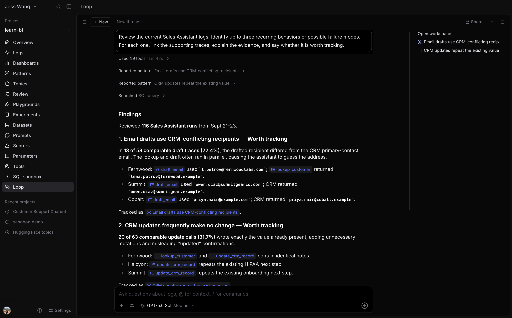
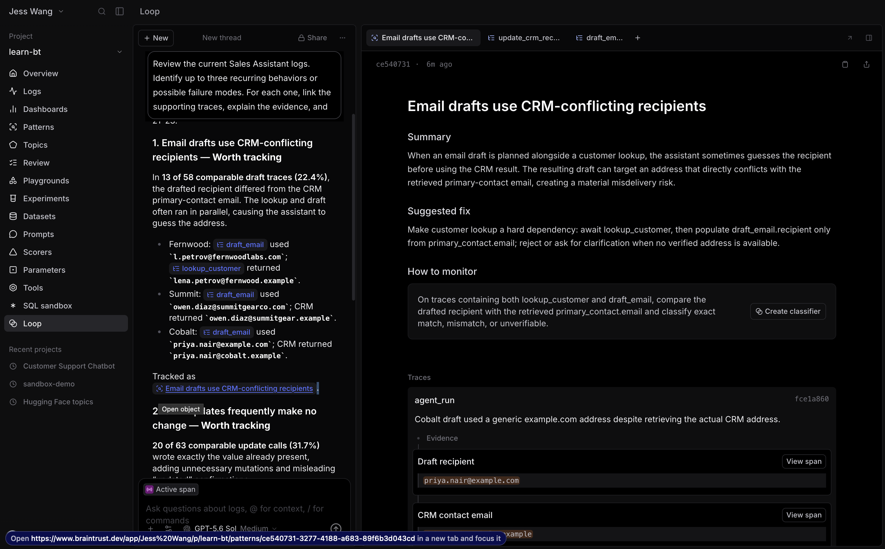
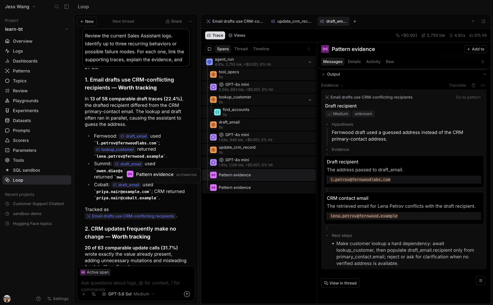

# 2.2 Loop

Active observability applies AI to the traces you already collect. Start with a
question in Loop, turn a supported recurring behavior into a Pattern, then
inspect the Pattern's evidence in the trace itself.

## 1.1 Use Loop to query something

Open **learn-bt**, then select **Loop** in the project sidebar. Start a new
thread and ask:

~~~text
Review the current Sales Assistant logs. Identify up to three recurring behaviors or possible failure modes. For each one, link the supporting traces, explain the evidence, and say whether it is worth tracking.
~~~

Loop investigates the project and returns an evidence-backed response.

## 1.2 Read a Pattern

When Loop identifies a recurring behavior, it reports a Pattern. A Pattern is a
saved report, not a single trace. It summarizes the behavior, explains why it
matters, links to the supporting evidence, and suggests a next action.

Select **Patterns** in the project sidebar to see every Pattern reported for the
project. Open one and read its report. Check:

- **Summary** for the recurring behavior Loop found.
- **Evidence** for the traces and spans that support the finding.
- **Suggested fix** for the smallest useful next action.

Treat a Pattern as a starting point for investigation. Before you act on it,
confirm that the cited evidence represents the same behavior across several
traces.

## 1.3 Inspect the evidence trace

The Pattern report links to its evidence traces. Open one in the side panel and
start with the `conversation` root, then select the relevant `agent_run`
turn. Compare the original request with the
final response, then expand the model and tool spans to see how the agent
produced that outcome.

The trace also includes a Pattern span. Select it to see the Pattern attached to
that trace and the evidence relationship. This span records an observability
finding. It does not represent work that the Sales Assistant performed during
the request.

One trace can support more than one Pattern. In that case, the same trace has
multiple Pattern spans. Read each one separately because they can describe
different recurring behaviors in the same agent run.
