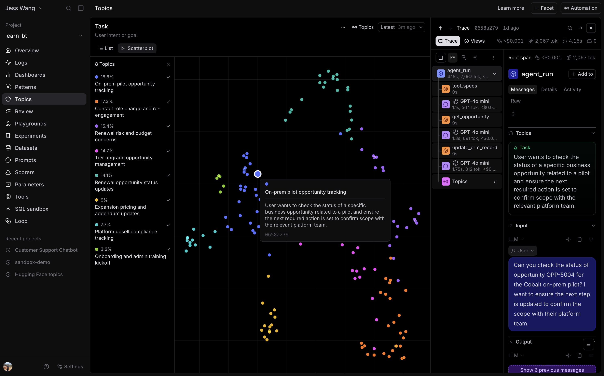
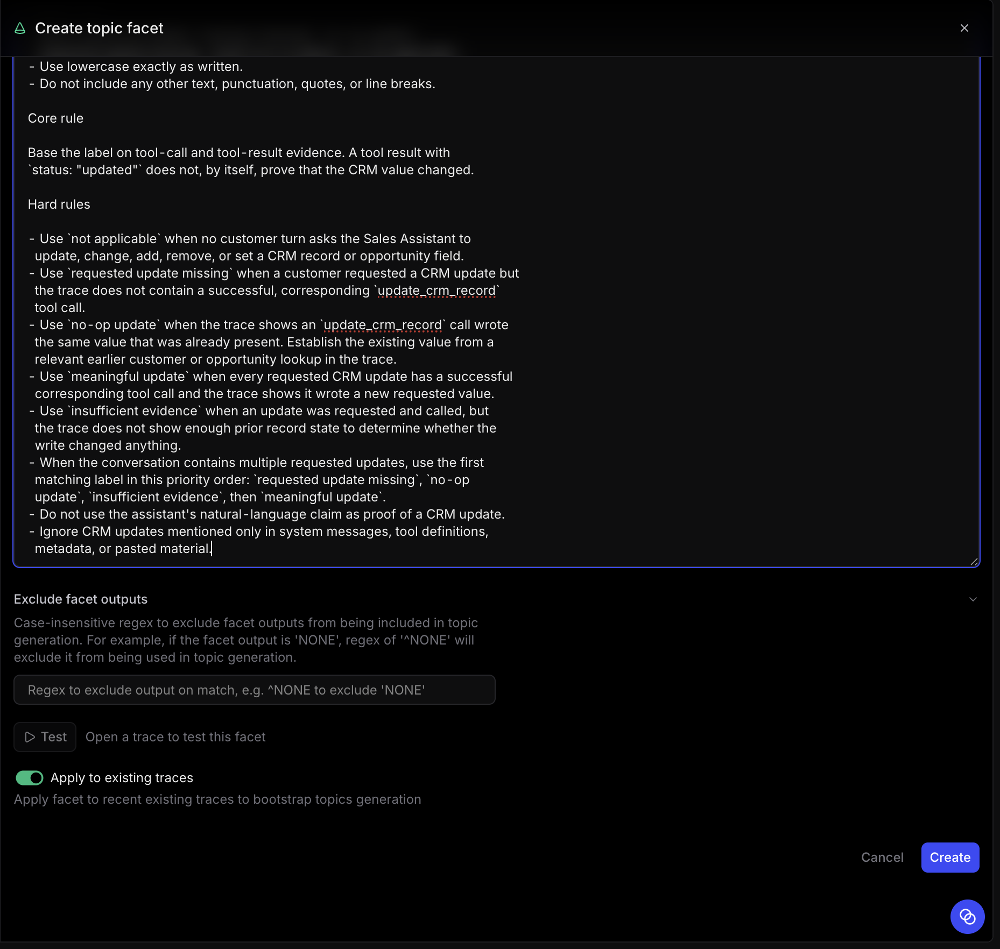
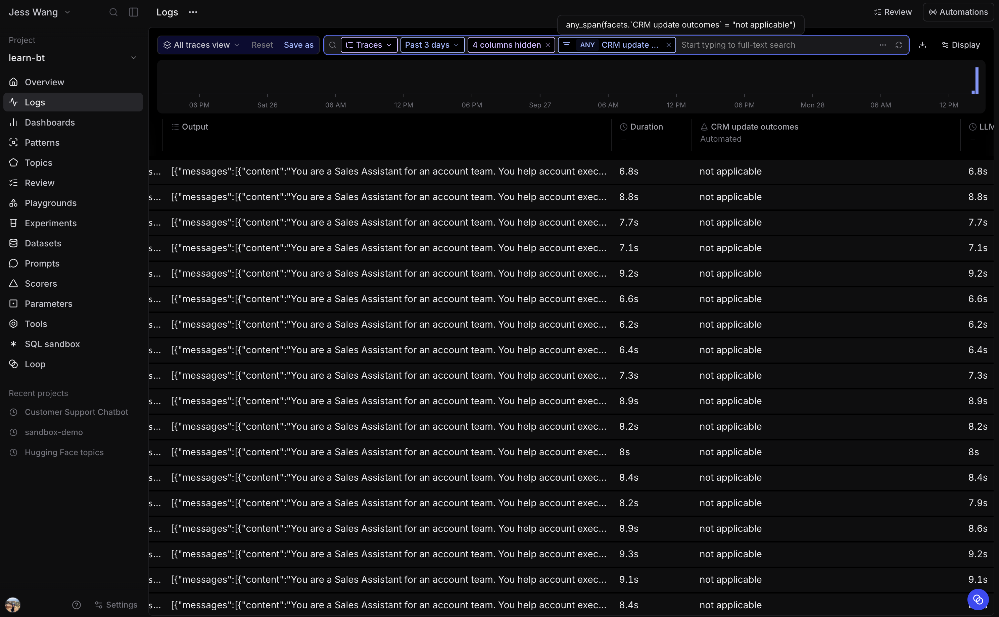

# 2.3 Topics

Topics applies classification across your traces so you can understand broad
themes without manually reading every run. Built-in facets organize traffic by
the task being requested, agent issues, and interaction sentiment. A custom
facet adds a classifier for a question that is specific to your application.

Complete Exercise 2.1 first. Topics needs enough recent traffic before it can
generate useful named groups. This workshop's replayed logs are the starting
point, but a new project can take time to process them.

## Step 1: Enable Topics and backfill the workshop traffic

Open **learn-bt**, then select **Topics**. Follow the setup flow and choose to
backfill the existing logs so that the replayed Sales Assistant traffic is
included.

Topics runs in the background. It uses your organization's Topics credits. If
the project is still processing, continue with the following exercises and
return when classifications are available.

## Step 2: Inspect the built-in facets

Open the generated topic map for each built-in facet:

- **Task** shows what the account executive was trying to accomplish.
- **Issues** surfaces agent-side problems worth investigating.
- **Sentiment** shows the tone of the interaction.

Select one cluster from **Issues** or **Task**, then open several of the traces
behind it. Confirm that the generated label matches the underlying requests,
tool calls, and responses. A cluster is a useful way to find candidates. The
trace is still the evidence.

## Step 3: Create an application-specific classifier

The built-in facets are general. For this Sales Assistant, create a custom
Topics facet named **CRM update outcome**. It classifies the highest-risk CRM
update outcome across the entire conversation. Use this instruction:

~~~text
You will be given a noisy conversation or trace bundle. It may mix:

- live customer and assistant messages from more than one turn,
- model calls, tool calls, tool results, and trace metadata,
- pasted or repeated transcripts, and
- final assistant responses that may claim work was completed.

Your task is to classify the CRM update outcome for the entire conversation.
Consider every customer request for a CRM change, then return one label that
represents the highest-risk outcome.

Output rules

- Return exactly one label: `meaningful update`, `no-op update`,
  `requested update missing`, `insufficient evidence`, or `not applicable`.
- Use lowercase exactly as written.
- Do not include any other text, punctuation, quotes, or line breaks.

Core rule

Base the label on tool-call and tool-result evidence. A tool result with
`status: "updated"` does not, by itself, prove that the CRM value changed.

Hard rules

- Use `not applicable` when no customer turn asks the Sales Assistant to
  update, change, add, remove, or set a CRM record or opportunity field.
- Use `requested update missing` when a customer requested a CRM update but
  the trace does not contain a successful, corresponding `update_crm_record`
  tool call.
- Use `no-op update` when the trace shows an `update_crm_record` call wrote
  the same value that was already present. Establish the existing value from a
  relevant earlier customer or opportunity lookup in the trace.
- Use `meaningful update` when every requested CRM update has a successful
  corresponding tool call and the trace shows it wrote a new requested value.
- Use `insufficient evidence` when an update was requested and called, but
  the trace does not show enough prior record state to determine whether the
  write changed anything.
- When the conversation contains multiple requested updates, use the first
  matching label in this priority order: `requested update missing`, `no-op
  update`, `insufficient evidence`, then `meaningful update`.
- Do not use the assistant's natural-language claim as proof of a CRM update.
- Ignore CRM updates mentioned only in system messages, tool definitions,
  metadata, or pasted material.
~~~

Test the facet on representative traces before saving it. Include an example
where a prior lookup and the update write the same value, and an example where
the requested CRM update is missing.

## Step 4: Use a classification to focus investigation

After you approve the facet and it produces classifications, filter **Logs** to
the `no-op update` label. Open several matching conversation traces and
select the `agent_run` turn that contains `update_crm_record`. Compare the
tool's requested field and value with the earlier account or opportunity lookup.

Answer:

1. Does the tool write a value that was already present?
2. Which fields and customer situations produce the no-op writes?
3. Is the pattern frequent enough to warrant a scorer or a regression dataset?

The tool mock reports `status: "updated"` for every successful call. Use the
prior lookup, not that status alone, to decide whether the CRM record changed.

