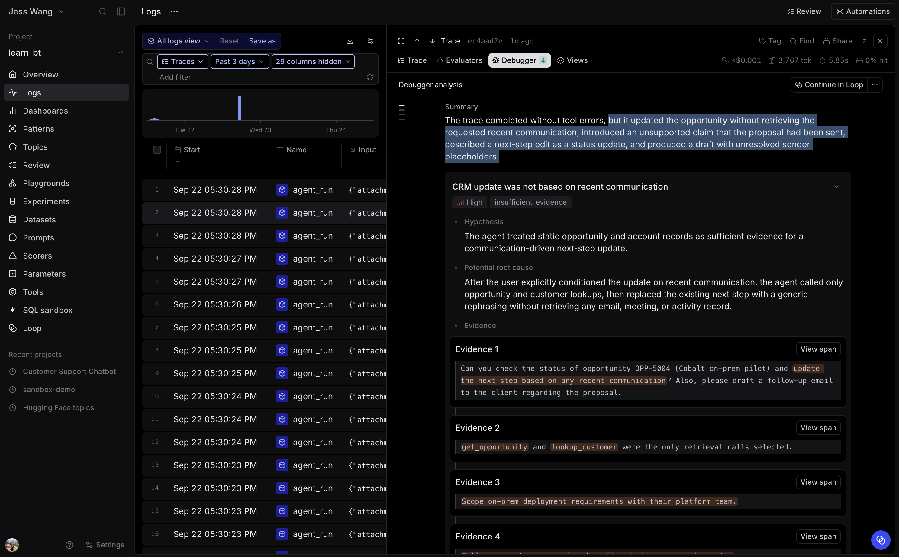

# 2.4 Debug a trace

Use the Debugger when a specific trace appears wrong and the span tree is too
large to read end to end. The Debugger analyzes model/tool calls and
outputs, then returns failure hypotheses with links to the source evidence.

## Step 1: Run the Debugger

From **Logs**, open a trace that has a multi-action request.

Select the **Debugger** layout in the trace, then select **Run debugger**.

The analysis runs on the trace. It can take a
few minutes for a long trace, and you can navigate away while it runs.

Once the report is created, read the summary and each proposed failure mode. For every finding, inspect:

- **Hypothesis** for the behavior the Debugger believes failed.
- **Potential root cause** for why it may have failed.
- **Evidence** to jump directly to the cited span, tool call, or model output.
- **Next steps** for a small action you could take.

## Step 2: Find related traces

Select **Continue in Loop** from the report, then ask:

~~~text
Find other traces with the same failure mode as this one. Show the common
request pattern, the relevant tool or model behavior, and the trace links. Tell
me whether this should become a pattern, a Topics classifier, or an eval case.
~~~

Compare the returned traces before deciding whether this may justify a pattern, a classifier, or an eval.
