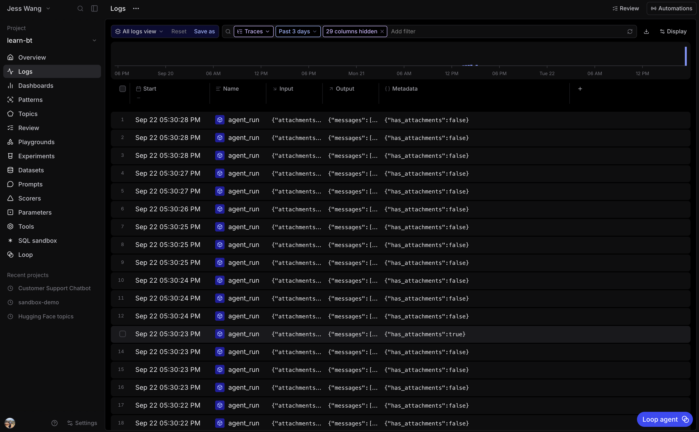
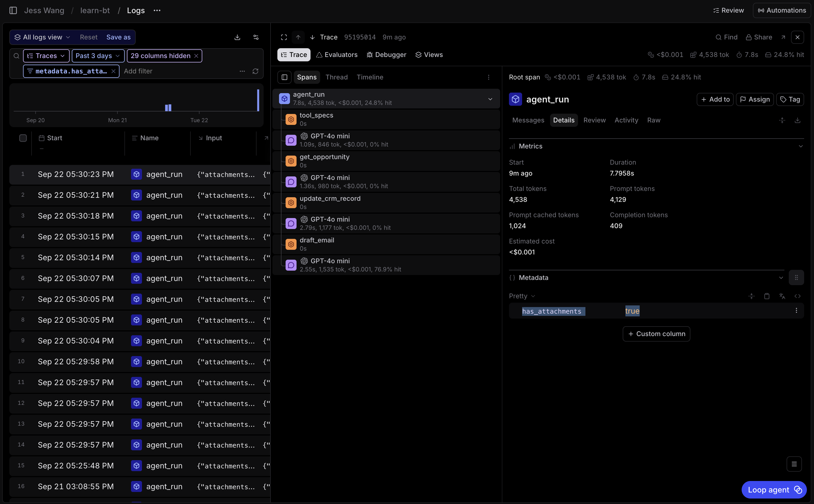
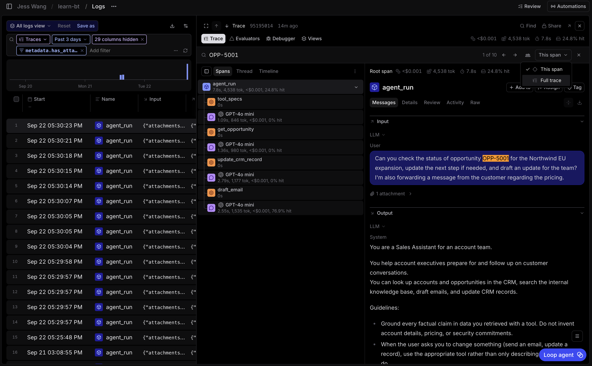

# 2.1 Query logs with filters, SQL, and the CLI [UI + CLI]

This exercise uses the traces you instrumented in Section 1. You will answer the same question with a Logs filter, SQL, and the CLI.

## Step 1: Create enough traffic

From the repository root, run either 1 of the 2 following commands:

Option 1:
~~~bash
uv run python -m scripts.seed --count 100 --attachment-ratio 0.2 --concurrency 10
~~~

Option 2:
~~~bash
uv run --env-file .env python -m scripts.seed_default --project learn-bt
~~~

`scripts.seed` (Option 1) creates up to 100 synthetic agent runs in your
`learn-bt` project using `gpt-4o-mini` (through the Braintrust Gateway)
to generate each account-executive request. The Sales Assistant also
uses `gpt-4o-mini` by default to handle that request.

If you want something quicker and cheaper, you can use `scripts.seed_default` (Option 2). This does not call a model provider. It reads the recorded spans and attachment
files bundled in `scripts/seed_default/snapshot/`, uploads the attachments to
your Braintrust org, gives the spans current timestamps, and inserts them into
the `learn-bt` project.

Wait for the command to finish before querying.

## Step 2: Filter attachment-bearing runs

Open **learn-bt**, then **Logs**. Add a filter to the root spans:

~~~sql
metadata.has_attachments = true
~~~

Open one result and confirm that its root input contains the attachment you added in Exercise 1.2. The boolean filter is faster than opening every nested LLM span.

## Step 3: Search for one business context

In the Logs search box, enter an opportunity ID or name:

~~~text
OPP-5001
~~~

Or:

~~~text
Northwind EU expansion
~~~

Open a matching trace. Search is useful when you know the situation you want to investigate but did not record it as structured metadata.

## Step 4: Export one row per run with SQL

Open the **SQL sandbox**. Start with this query:

~~~sql
SELECT
  created,
  input.prompt AS request,
  output.output AS response,
  metrics.tokens AS tokens,
  metrics.estimated_cost AS estimated_cost
FROM project_logs('learn-bt')
WHERE is_root = true
  AND created >= NOW() - INTERVAL '7 days'
ORDER BY metrics.estimated_cost DESC
~~~

Run it, then select **Download** to export a CSV. The root-span condition matters. Without it, each LLM and tool span becomes a separate row.

If your root input or output has a different shape, inspect one trace and adjust the input or output fields. The [SQL reference](https://www.braintrust.dev/docs/reference/sql) lists the available columns and functions.

## Step 5: Run the same query with the CLI

From the repository root, run:

~~~bash
bt sql "SELECT created, input.prompt AS request, output.output AS response, metrics.tokens AS tokens, metrics.estimated_cost AS estimated_cost FROM project_logs('learn-bt') WHERE is_root = true AND created >= NOW() - INTERVAL '7 days' ORDER BY metrics.estimated_cost DESC" --env-file .env
~~~

Compare the terminal result with your CSV. Both should show one row per agent run in the same cost order. The UI is useful for exploration. The CLI is useful in scripts and coding-agent workflows.
