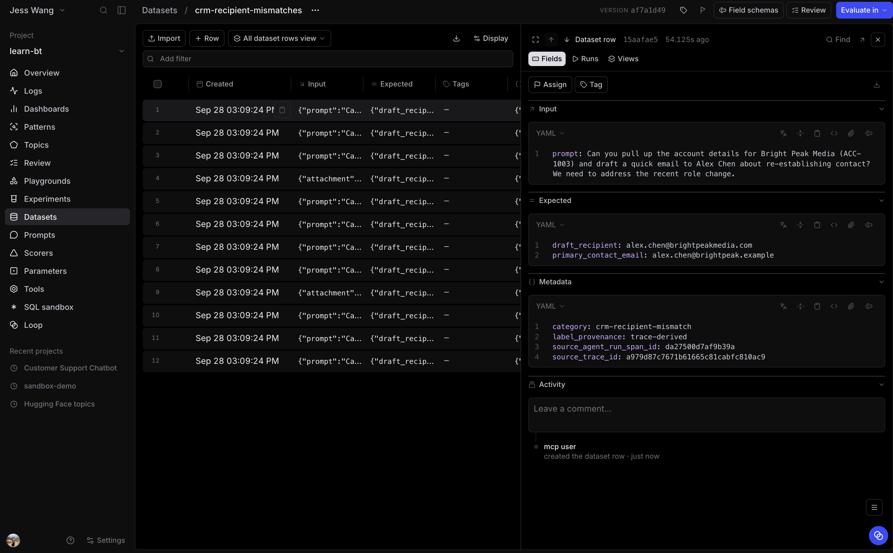

# 3.2 Build a recipient-mismatch regression dataset

In the previous module, Loop found customer email drafts whose recipient did not
match the primary contact returned by the CRM. Turn every proven example into a
dataset named **crm-recipient-mismatches**.

This is a focused regression dataset. It contains only known recipient failures,
not a representative sample of all Sales Assistant traffic. You will first show
that the current agent still fails these cases, then fix the implementation and
rerun this exact dataset.

## Step 1: Create the failure dataset with Loop

Open **Loop** from **Logs** and enter:

~~~text
Create a dataset named crm-recipient-mismatches from the current Sales Assistant logs.

Find every customer-facing chat_turn that contains both lookup_customer and draft_email. Include a row only when the drafted email recipient differs from the primary_contact.email returned by lookup_customer in that same chat_turn. Exclude internal-team and generic-mailbox drafts, user-supplied alternate recipients, ambiguous customer lookups, and runs without a usable lookup or draft.

Create one row per failed chat_turn. Preserve the original turn rather than rewriting it: store its exact request as input.prompt, its recorded history as input.history when present, and its attachment reference as input.attachment when present. Store the original CRM primary-contact email and the mismatched draft recipient in expected. Store the source trace ID, source chat_turn span ID, category crm-recipient-mismatch, and label provenance trace-derived in metadata. Do not put the prior draft, tool result, or final response into input because the eval must generate those again.

Link every source trace, report the number of rows created, and state any failures you excluded because the recorded input could not be replayed.
~~~

## Step 2: Inspect the regression cases

Open **Datasets**, then **crm-recipient-mismatches**. Confirm that it contains
only recipient-mismatch failures. Each row must have `input.prompt`, and it must
preserve conversation history and the source attachment when the original turn
had them.

Open several rows and verify that `expected.crm_primary_contact_email` differs
from `expected.source_draft_recipient`. Keep this dataset unchanged while you
make the fix. The frozen inputs make the before-and-after experiments comparable.
