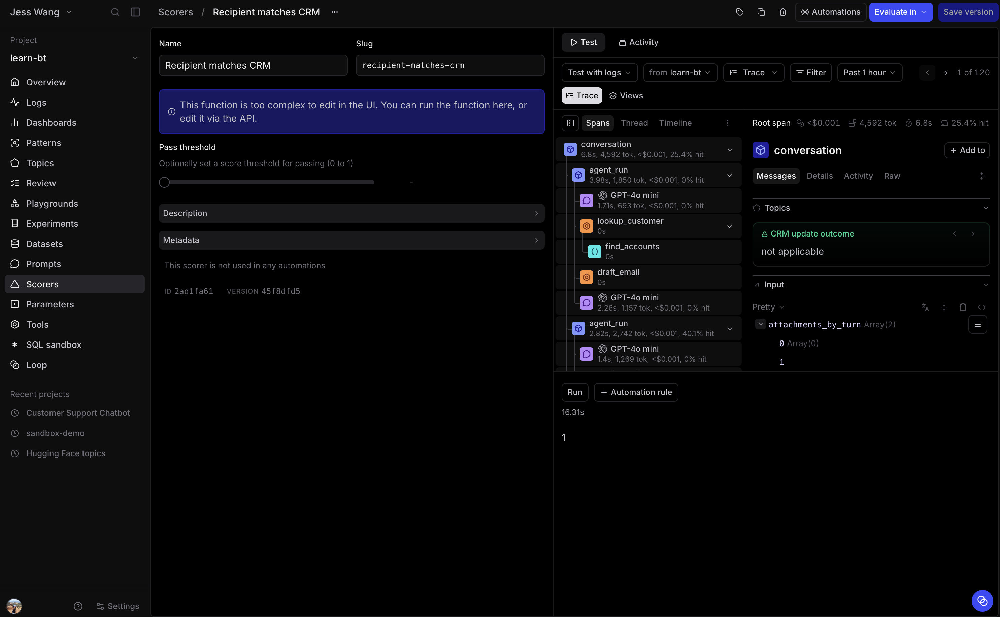

# 3.3 Create a CRM-recipient scorer

The regression dataset records why each source turn failed. The eval must judge
the new run, however, rather than repeat that stored label. The drafted recipient
and the CRM primary-contact email both exist in the new trace, so this behavior
needs a deterministic scorer, not an LLM judge.

A deterministic scorer applies a fixed comparison to structured tool output and
does not ask another model for a judgment. You could build an equivalent check in
Loop, but this exercise shows how to define and version the scorer in code for
reuse in evals.

The agent's final response is not the email object. The scorer must inspect the
trace, find the **lookup_customer** and **draft_email** tool spans, then compare
their structured outputs.

Open **evals/scorers.py**.

## Step 1: Replace the scorer scaffold

Replace the entire file with:

~~~python
import braintrust
from pydantic import BaseModel

project = braintrust.projects.create(name="learn-bt")

class TraceParams(BaseModel):
    trace: dict

def crm_primary_contact_emails(tool_spans):
    emails = set()
    for span in tool_spans:
        if (span.span_attributes or {}).get("name") != "lookup_customer":
            continue

        accounts = (span.output or {}).get("accounts", [])
        for account in accounts:
            contact = account.get("primary_contact") or {}
            email = contact.get("email")
            if email:
                emails.add(email.strip().casefold())
    return emails

async def recipient_matches_crm(trace=None):
    if not trace:
        return None

    tool_spans = await trace.get_spans(span_type=["tool"])
    draft = next(
        (
            span
            for span in tool_spans
            if (span.span_attributes or {}).get("name") == "draft_email"
        ),
        None,
    )
    if not draft:
        return 0

    recipient = ((draft.output or {}).get("email") or {}).get("recipient", "")
    expected_recipients = crm_primary_contact_emails(tool_spans)
    if not recipient or not expected_recipients:
        return 0

    return int(recipient.strip().casefold() in expected_recipients)

project.scorers.create(
    name="Recipient matches CRM",
    slug="recipient-matches-crm",
    parameters=TraceParams,
    handler=recipient_matches_crm,
)
~~~

The helper collects every verified primary-contact email returned by a customer
lookup. The scorer returns 1 only when the draft recipient matches one of those
addresses. It returns 0 when the agent did not draft an email, did not retrieve
a usable CRM address, or drafted to a different address.

This fail-closed behavior makes missing retrieval visible. If the agent does not
look up the customer, it cannot prove that a recipient is correct.

The source row's `expected` values are audit evidence for the original failure.
This scorer does not read them. It measures the recipient the agent drafts on
each new eval trace.

## Step 2: Push and inspect the scorer

Push from inside **evals**:

~~~bash
cd evals
bt functions push scorers.py --env-file ../.env
~~~

Open **learn-bt**, then select **Scorers**. Confirm that **Recipient matches
CRM** appears. Open it up and press "Run" on a sample trace.

On later edits, run the same command with **--if-exists
replace**.

## Answer key

Compare your completed [evals/scorers.py](solutions/03-creating-scorers/evals/scorers.py)
with this answer key.
