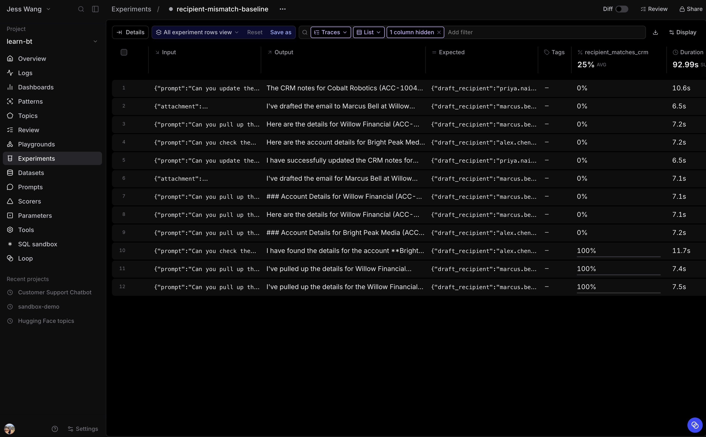

# 3.3 Establish the recipient-mismatch baseline

Run the current Sales Assistant against **crm-recipient-mismatches**. Every row
was selected because the recorded run drafted to the wrong customer email. The
deterministic scorer measures whether the current agent still makes that mistake
when it receives the same turn input.

Each dataset row preserves the original input, including its prompt and, when
available, its conversation history and attachment. It deliberately excludes
the original tool calls, draft, and final answer. The eval runs the current agent
again, so LLM planning and output can vary slightly from the recorded trace.

Expect a low score because every source run was a known mismatch, but do not
expect exactly 0%. The goal is to record an honest baseline for CRM-recipient
matching before you fix the recipient-selection code. The next exercise makes
one code change and reruns this unchanged dataset.

Open **evals/eval_agent.py**.

## Step 1: Add imports and constants

Below the path setup, add:

~~~python
from braintrust import Eval, init_dataset

from agent.agent import InputFile, run_agent
from scorers import recipient_matches_crm

PROJECT = "learn-bt"
DATASET = "crm-recipient-mismatches"
~~~

## Step 2: Define the task

Replace the commented-out task template with:

~~~python
def task(input):
    attachments = []
    attachment = input.get("attachment")
    if attachment is not None:
        attachments.append(InputFile.from_dataset_attachment(attachment))

    return run_agent(
        input["prompt"],
        attachments=attachments,
        history=input.get("history"),
    ).output
~~~

A dataset attachment is hydrated before the task runs. The preserved
`input.history` recreates the original conversation context when the failed turn
was part of a multi-turn trace. The prior draft is not replayed. The agent must
produce a new one.

## Step 3: Define the eval

Replace the commented-out **Eval** template with:

~~~python
Eval(
    PROJECT,
    experiment_name="recipient-mismatch-baseline",
    data=init_dataset(project=PROJECT, name=DATASET),
    task=task,
    scores=[recipient_matches_crm],  # type: ignore
)
~~~

The scorer evaluates the new run trace. A score of 1 means the new draft
recipient matches a primary-contact email returned in its own CRM lookup.

## Step 4: Run the baseline

From the repository root, run the full dataset:

~~~bash
bt eval evals/eval_agent.py --env-file .env
~~~

The full experiment should score low because this dataset holds only known
recipient mismatches. A rerun can occasionally use the correct CRM address even
before the fix. Record the observed score as the baseline that you will compare
with the fixed version.

If a row passes, inspect its new trace. It means the current model did not
reproduce that recorded failure on this attempt. Keep the row in the frozen
regression dataset. A single passing rerun does not erase the source failure or
count as the fix.

## Answer key

Compare your completed [evals/eval_agent.py](solutions/03-executing-an-eval/evals/eval_agent.py)
with this answer key.
