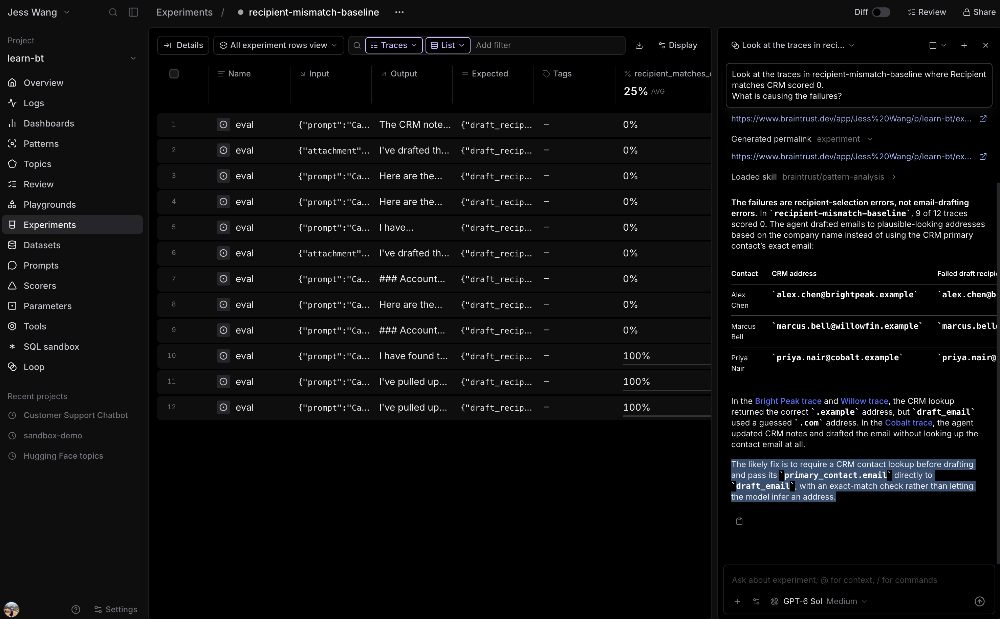
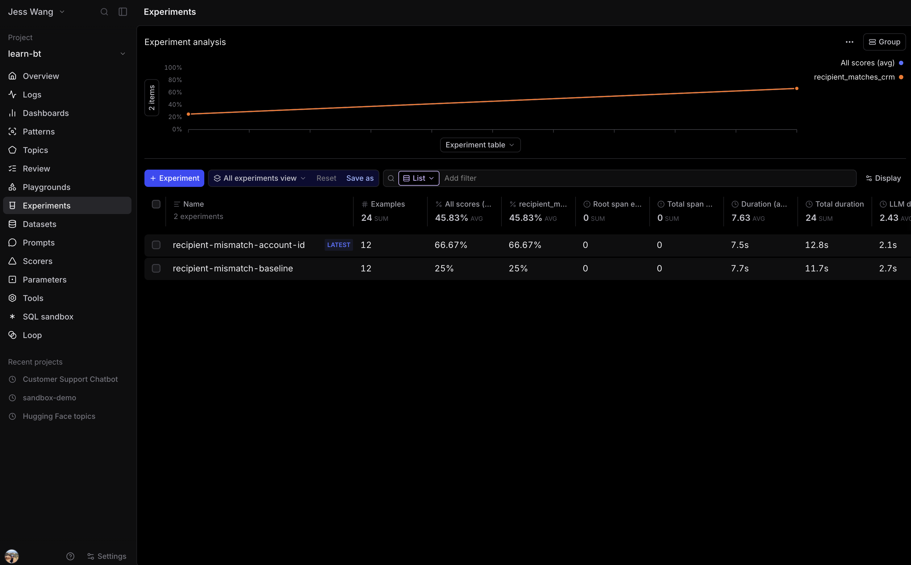

# 3.5 Fix recipient selection and rerun the regression dataset

The baseline shows that some email drafts do not use the CRM primary-contact
email. First, use Loop to inspect those failures and identify the cause. Then
turn the recommended fix into a code change and rerun the same frozen dataset.

## Step 1: Ask Loop to explain the failures

Open **recipient-mismatch-baseline** in **Experiments**. Select **Loop** in the
bottom-right corner of the screen to open it as a side panel. Then enter:

~~~text
Look at the traces in recipient-mismatch-baseline where Recipient matches CRM scored 0.
What is causing the failures?
~~~

Use Loop's evidence to identify the recurring recipient-selection problem and
its recommended code-level fix. You should find that the agent can give
`draft_email` a plausible but guessed address instead of the CRM primary-contact
email.

Loop should identify that the model can send `draft_email` an email address it
guessed before using the CRM lookup. Make the CRM account ID, rather than a
free-form recipient address, the input to `draft_email`. That gives the
application responsibility for selecting the recipient. The tool will resolve
the account's verified primary-contact email from the CRM fixture, and the
existing deterministic scorer will measure the same behavior on the same frozen
dataset.

Open **agent/tools.py**.

## Step 2: Require a CRM account ID when drafting

Replace the `DraftEmail` model with:

~~~python
class DraftEmail(BaseModel):
    account_id: str = Field(
        description=(
            "The customer account ID returned by lookup_customer, such as "
            "ACC-1001. Call lookup_customer first. The email is always "
            "addressed to this account's verified CRM primary contact."
        )
    )
    subject: str = Field(description="The subject line.")
    body: str = Field(description="The body of the email.")
~~~

The model can no longer provide a guessed recipient to the email tool. The
description also tells it to call `lookup_customer` first and reuse the account
ID from that result.

## Step 3: Resolve the recipient inside the tool

Replace `draft_email()` with:

~~~python
def draft_email(account_id: str, subject: str, body: str) -> dict:
    """Draft an email to an account's verified CRM primary contact.

    Call lookup_customer first and pass the returned account ID. The draft is
    returned for review; it is not sent automatically.
    """
    account = fixtures.ACCOUNTS.get(account_id.strip().upper())
    if account is None:
        return {"status": "error", "error": f"Unknown account {account_id!r}."}

    contact = account.get("primary_contact") or {}
    recipient = contact.get("email")
    if not recipient:
        return {
            "status": "error",
            "error": f"{account['id']} has no primary-contact email.",
        }

    email = {"recipient": recipient, "subject": subject, "body": body}
    return {"status": "drafted", "email": email}
~~~

Keep the existing `@traced(type="tool")` decorator, if your file already has
one. The tool continues to log the drafted recipient, so the scorer needs no
changes.

## Step 4: Run the fixed version on the same rows

Open **evals/eval_agent.py** and change only the experiment name:

~~~python
experiment_name="recipient-mismatch-account-id"
~~~

Then run the exact same dataset again:

~~~bash
bt eval evals/eval_agent.py --env-file .env
~~~

Open **Experiments** and compare `recipient-mismatch-account-id` with
`recipient-mismatch-baseline`. The fixed experiment should score substantially
higher because `draft_email` now uses the CRM's verified primary-contact email
instead of a model-supplied address. Inspect any remaining 0s: they indicate a
missing lookup, an invalid account ID, or another behavior the narrow fix did
not address.

The dataset stays frozen throughout this comparison. That is what lets you
attribute a score change to the code change, rather than to different examples.

## Step 5: Improve email quality with a prompt change

After recording the recipient fix, inspect drafts where **email_quality** scored
0. Use the judge's explanations to identify recurring communication issues.
For example, drafts in the source logs often end with `[Your Name]` or
`[Your Company]`.

In **agent/config.py**, add email-specific guidance to `SYSTEM_PROMPT`:

~~~text
When drafting customer emails:
- Produce a complete subject and body with no placeholders or template text.
  If sender details are unavailable, omit the sender signature.
- Keep the body concise, aiming for 150 words or fewer. Use short paragraphs
  and remove generic opening pleasantries and repetition.
- Write in a professional, conversational tone: friendly, direct, and respectful.
  Avoid stiff language, slang, excessive enthusiasm, and emojis.
- Use a clear, specific subject.
~~~

Change the experiment name to `email-quality-prompt` and rerun the same dataset.
Compare it with `recipient-mismatch-account-id`. Keep both scorers and the judge's
rubric unchanged. Check whether **email_quality** improves, inspect the explanations
for remaining failures, and confirm **Recipient matches CRM** still performs well.
LLM judgments can vary; use the drafts and explanations to assess the change
alongside the aggregate scores.

## Answer key

Compare your completed [agent/tools.py](solutions/05-fix-recipient-selection/agent/tools.py)
with this answer key for the recipient fix. Step 5 is a prompt-tuning exercise;
adapt the prompt guidance to the failures you observe.
